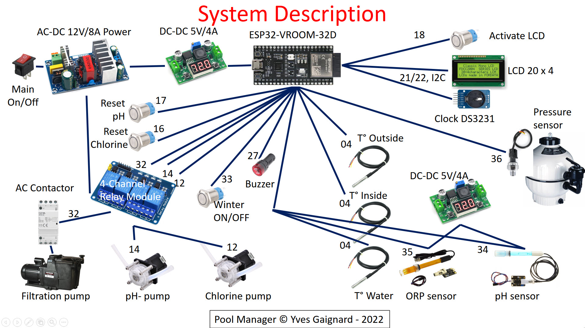

# PoolManager
A complete automation to control and manage the swimming pool.

## Introduction
The automation for a swimming-pool is something reserved to top-of-the-range systems. Here you can find an affordable, simple but powerful automation-system that you can build by yourself with a little time and effort.

Not only home things can be automated. Indeed, a swimming-pool is something where automation reports incomparable benefits in time, money and ecology.

The main objective is to build a modular system that allows controlling the peripherals as simple (and cheap) as possible, transferring all intelligence to a ESP32 controling all what happens in the pool (and outside).

## Overview
Basically, you need a bypass PVC tube with the sensors, peristaltic pumps to inject liquids to regulate chemical parameters, and a box with a ESP32, that runs all the code of the project, responsible of all automation, monitoring and control.

## Bill of materials

As you can see the bill of material is not long. 
To increase reliability and maintainability, I chose standard components that can be assembled together instead of creating a PCB and solding individual components.

| Component      | Number | Description                                                |
|----------------|--------|------------------------------------------------------------|
| ESP32-VROOM-32D or ESP32-VROOM-32U |    1   | The microntroller wich have a lot of resources to propose: 32-bit Xtensa dual-core @240MHz Wi-Fi IEEE 802.11 b/g/n 2.4GHz Bluetooth 4.2 BR/EDR and BLE 520 KB SRAM (16 KB for cache) 448 KB ROM 34 GPIOs, 4x SPI, 3x UART, 2x I2C, 2x I2S, RMT, LED PWM, 1 bost SD/eMMC/SDIO, 1 slave SDIO/SPI, TWAI, 12-bit ADC, Ethernet|
| ESP32 Breakout board|    1   | 38Pin ESP32 Breakout Board for ESP32 Development Board 2.4 GHz Wifi Dual Core|
| ON/OFF 250V    |    1   | on off 250V Heavy Duty 4 pin DPST IP67 Sealed Waterproof Marine Toggle Rocker Switch with LED 220V|
| AC-DC 12V 8A Power Supply|    1   | AC-DC 12V 8A 100W Switching Power Supply Board Circuit Module C Switching Power Supply Module AC 110v 220|
| DC-DC Buck Step Down Module LM2596|    2   |DC-DC Buck Step Down Module LM2596 DC/DC 4.0~40V to 1.25-37V Adjustable Voltage Regulator With LED Voltmeter|
| LCD 20x04 +I2C |    1   | Displays 4-lines X 20-characters. Operate with 5V DC. Size : 60mm×99mm Pin Definition : GND.VCC.SDA.SCL|
| DS3231 RTC     |    1   | DS3231 is a low-cost, extremely accurate I2C real-time clock (RTC), with an integrated temperature-compensated crystal oscillator (TCXO) and crystal|
| push button    |    4   | 16mm metal push button switch power button Waterproof Flat circular button LED light self-lock self-reset button 1NO1NC|
| 4-channels relay output modules|    1   | Maximum load: AC 250V/10A, DC 30V/10A Trigger current: 5mA, Working voltage: 5V|
| Peristaltic Pump DP520-220|    2   | INTLLAB DIY Peristaltic Pump Dosing Pump 12V DC High Flowrate for Aquarium Lab Analytical INPUT: DC 12V 800mA TUBE MATERIAL: food grade silicone tube FLOW DIRECTION: flow direction can be controlled by the positive and negative connection WORKING CONDITION: 0~40℃, relative humidity <80%|
| Analog ORP     |    1   | Gravity Series Analog ORP (Oxidation-Reduction Potential) Meter Water Quality Detection Sensor compatible with Arduino DIY|
| pH sensor + module|    1   | Liquid PH 0-14 Value Detection Regulator Sensor Module Monitoring Control Meter Tester  + BNC PH Electrode Probe For Arduino|
| DS18B20        |    3   | DS18B20 Waterproof Digital Temperature Sensor Probe NTC Thermistor Thermal Cable|
| Pressure sensor|    1   | 5V G1/4 0-1.2 MPa Hydraulic Pressure Sensor for Non-Corrosive Water / Oil / Gas Pressure Sensor 1/4" Diameter for Arduino|
| Immersion Sleeve Pocket|    1   | Thermowell Immersion Sleeve Pocket Stainless Steel 304 BSP 1/2" for Max 6mm Wire|
| Flash light + Buzzer|    1   | AD16-22SM 12V 22mm Flash Signal Light Red LED Active Buzzer Beep Alarm Indicator Red|

## Instructions

### Build the system

(TO DO)

### Setup your development environment
This project has been develop using PlatformIO + VSCode.
If you begin with this environment, follow the excelent article: [Getting Started with VS Code and PlatformIO IDE for ESP32 and ESP8266 (Windows, Mac OS X, Linux Ubuntu)](https://randomnerdtutorials.com/vs-code-platformio-ide-esp32-esp8266-arduino/).

This article is proposed by the [Random Nerd Tutorials](https://randomnerdtutorials.com/) site. This site is the Reference for everyone who develop with an ESP32.
You'll find a lot of tutorials and examples.

Once your environment is ready, you can setup your project. 
(TODO)

### Customize and configure
To customize and configure the Pool Manager application, consult the dedicated README [here](include/README.md).
